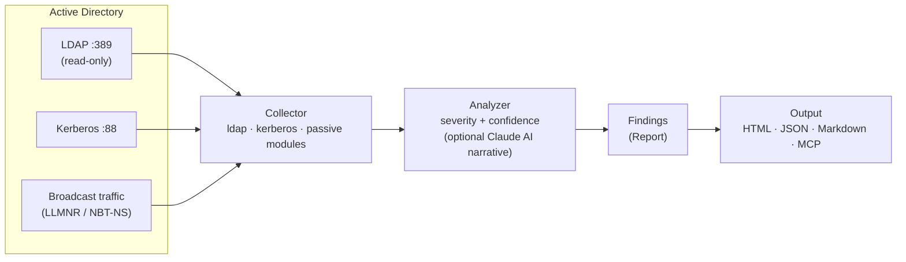

# DIEGO - Domain Intranet Elusive Guardian & Offensive-Scouter

Non-privileged Active Directory security diagnostic agent, written in Pure Rust.

---

**DIEGO** is a post-exploitation reconnaissance and security diagnostic agent for Active Directory environments. It operates entirely with standard domain user credentials, produces no noisy network artefacts, and ships as a single static binary.

### Sample HTML Report

[](docs/sample-report.html)

A single self-contained HTML file (no CDN, works air-gapped) with a severity summary, attack-path overview, a sortable/filterable findings table with **Severity × Confidence**, baseline diff, and an audit-style appendix. **[▶ Live demo](https://kent-tokyo.github.io/diego/sample-report.html)** · [sample JSON](docs/sample-findings.json)

## Architecture



Standard-user credentials in, prioritised findings out — no writes, no OS command execution.

---

## Key Pillars

- **Unprivileged** — Works with standard domain user credentials only. No administrator rights required at any stage.
- **Stealth (OPSEC-friendly)** — Issues only legitimate AD queries. No aggressive scanning. Configurable jitter between requests blends with normal domain traffic.
- **Portable** — Single static binary with zero runtime dependencies. Drop and run on any target host.
- **Pure Rust** — No .NET CLR, no PowerShell, no Python interpreter. Every protocol interaction — Kerberos ASN.1 framing, LDAP, RC4-HMAC — is implemented in pure Rust (RustCrypto). This avoids the *host-based* ETW / AMSI / Script Block Logging telemetry that EDR products lean on most heavily for .NET/PowerShell tooling. See [Detection considerations](#detection-considerations) for what this does **not** evade.
- **AI-First** — Claude API integration synthesises scan output into a coherent attack narrative. MCP server mode allows LLM clients to orchestrate individual diagnostic tools directly.

---

## Quick Start

```bash
# CLI mode — run all diagnostic modules
# Password can be omitted; diego will try: env var → keytab → TGT cache → interactive prompt
diego --dc 10.0.0.1 --domain corp.local --username jdoe

# With explicit password (least secure; avoids shell history with env var instead)
diego --dc 10.0.0.1 --domain corp.local --username jdoe --password P@ss

# With AI analysis (requires ANTHROPIC_API_KEY)
diego --dc 10.0.0.1 --domain corp.local --username jdoe --ai-analyze

# Interactive AI chat after scan
diego ... --ai-analyze --chat

# MCP server mode (for Claude Desktop / MCP clients)
diego --mcp
```

### Password Resolution (Priority Order)

When password is not provided with `--password`, diego tries these methods in order:

1. **`$DIEGO_PASSWORD` environment variable** — Most OPSEC-friendly for scripts
   ```bash
   export DIEGO_PASSWORD="P@ssw0rd"
   diego --dc 10.0.0.1 --domain corp.local --username jdoe
   ```

2. **Kerberos keytab** — `~/.diego/keytab` (no password needed)
   ```bash
   # Set up keytab (requires kinit or ktutil)
   ktutil: addent -password -p user@CORP.LOCAL -k 1 -e aes256-cts-hmac-sha1-96
   ktutil: write_kt ~/.diego/keytab
   
   # Then run without password
   diego --dc 10.0.0.1 --domain corp.local --username jdoe
   ```

3. **Kerberos TGT cache** — `KRB5CCNAME` env var or `/tmp/krb5cc_*` (no password needed)
   ```bash
   # If already logged into Kerberos realm:
   klist  # Check cached ticket
   diego --dc 10.0.0.1 --domain corp.local --username jdoe
   ```

4. **Interactive prompt** — Fallback if none above are available
   ```
   $ diego --dc 10.0.0.1 --domain corp.local --username jdoe
   Password: █████████
   ```

---

## CLI Usage & Examples

### Syntax

```bash
diego [OPTIONS]
```

### Required Options (for CLI mode)

| Option | Description | Example |
|--------|-------------|---------|
| `--dc <DC>` | Domain Controller IP address | `--dc 10.0.0.1` |
| `--domain <DOMAIN>` | Domain name | `--domain corp.local` |
| `--username <USERNAME>` | Domain user for authentication | `--username jdoe` |
| `--password <PASSWORD>` | Password (or `DIEGO_PASSWORD` env var) | `--password 'P@ssw0rd'` |

### Optional Parameters

| Option | Default | Description |
|--------|---------|-------------|
| `--modules <MODULES>` | `all` | Specific modules: `kerberos`, `ldap`, `passive`, or `all` |
| `--output <OUTPUT>` | `stdout` | Output file path |
| `--format <FORMAT>` | `json` | Output format: `json`, `markdown`, or `html` |
| `--baseline <PATH>` | — | Prior diego JSON report to diff against (shows new / resolved / severity-changed findings) |
| `--timeout <TIMEOUT>` | `10` | Per-query timeout in seconds |
| `--interface <INTERFACE>` | Auto-detect | Network interface for passive listening |
| `--ai-model <AI_MODEL>` | `claude-sonnet-4-6` | Claude model for analysis |

### Examples

#### 1. Full Scan (All Modules)

Run all diagnostic modules and output JSON findings:

```bash
diego --dc 10.0.0.1 --domain corp.local \
  --username jdoe --password 'P@ssw0rd' \
  --format json --output findings.json
```

**Sample Output (JSON):**
```json
{
  "domain": "corp.local",
  "dc_ip": "10.0.0.1",
  "timestamp": "2025-06-14T10:30:45Z",
  "modules_run": ["ldap", "kerberos", "passive"],
  "findings": [
    {
      "id": "LDAP-ASREP-candidate-001",
      "severity": "Critical",
      "title": "AS-REP Roastable Account Detected",
      "description": "Account 'svc_backup' has Kerberos pre-authentication disabled",
      "affected_object": "svc_backup",
      "object_type": "user",
      "mitre_tactic": "T1558.001",
      "mitre_technique": "Steal or Forge Kerberos Tickets / AS-REP Roasting",
      "remediation": "Enable Kerberos pre-authentication on the account"
    },
    {
      "id": "KRB-ASREP-HASH-svc_backup",
      "severity": "Critical",
      "title": "AS-REP Hash Captured",
      "description": "Kerberos AS-REP hash captured for offline cracking",
      "affected_object": "svc_backup",
      "object_type": "hash",
      "hash_value": "$krb5asrep$23$svc_backup@CORP.LOCAL:...",
      "mitre_tactic": "T1558.001"
    },
    {
      "id": "LDAP-UNCONSTRAINED-admin-host-01",
      "severity": "High",
      "title": "Unconstrained Delegation Detected",
      "description": "Computer account 'admin-host-01' has unconstrained delegation enabled",
      "affected_object": "admin-host-01",
      "object_type": "computer",
      "mitre_tactic": "T1187"
    }
  ],
  "summary": {
    "total_findings": 3,
    "critical": 2,
    "high": 1,
    "medium": 0,
    "low": 0
  }
}
```

#### 2. Kerberos-Only Scan

Target specific attacks (AS-REP Roasting + Kerberoasting):

```bash
diego --dc 10.0.0.1 --domain corp.local \
  --username jdoe --password 'P@ssw0rd' \
  --modules kerberos \
  --output kerb_hashes.json
```

Produces Hashcat-compatible hashes (`$krb5asrep$`, `$krb5tgs$`) for offline cracking.

#### 3. LDAP Enumeration Only

Map AD topology and extract policy information:

```bash
diego --dc 10.0.0.1 --domain corp.local \
  --username jdoe --password 'P@ssw0rd' \
  --modules ldap \
  --format markdown --output domain_report.md
```

**Discoveries include:**
- Domain controllers and site topology
- Password policy (lockout threshold, age, complexity)
- Unconstrained delegation accounts
- SPNs and service accounts
- High-privilege group members
- Description field credential leaks

#### 4. Passive Monitoring (LLMNR/NBT-NS)

Capture broadcast-based DNS requests to identify spoofing targets:

```bash
diego --dc 10.0.0.1 --domain corp.local \
  --username jdoe --password 'P@ssw0rd' \
  --modules passive \
  --interface eth0 \
  --timeout 30
```

Detects:
- Unresolved hostname queries (LLMNR/NBT-NS)
- Cleartext protocol usage (HTTP auth, FTP, SMTP, Telnet credentials)
- Hosts susceptible to responder-based attacks

#### 5. AI-Powered Attack Narrative

Analyze findings and synthesize attack paths:

```bash
export ANTHROPIC_API_KEY="sk-ant-..."

diego --dc 10.0.0.1 --domain corp.local \
  --username jdoe --password 'P@ssw0rd' \
  --ai-analyze \
  --format markdown --output attack_narrative.md
```

**AI Output Example:**
```
## Attack Narrative: CORP.LOCAL

### Executive Summary
The domain has 3 critical misconfigurations enabling rapid escalation to Domain Admin.

### Attack Chain
1. **Initial Access** — AS-REP roast 'svc_backup' account (pre-auth disabled)
2. **Privilege Escalation** — Kerberoast 'ms-sql-svc' (weak password)
3. **Lateral Movement** — Use roasted ticket + unconstrained delegation on 'admin-host-01'
4. **Domain Compromise** — Steal KRBTGT key via DCSync

### Top 5 Remediations (by impact)
1. Enable Kerberos pre-authentication (blocks AS-REP)
2. Rotate service account passwords and enforce complexity
3. Disable unconstrained delegation; use constrained delegation instead
...
```

#### 6. Interactive AI Chat

Explore findings interactively:

```bash
diego --dc 10.0.0.1 --domain corp.local \
  --username jdoe --password 'P@ssw0rd' \
  --chat
```

Then ask Claude:
```
> What are the most critical risks?
> Can you explain the Kerberoasting attack in detail?
> What's the fastest path to Domain Admin?
> How would EDR detect these techniques?
```

#### 7. Markdown Report (Human-Friendly)

```bash
diego --dc 10.0.0.1 --domain corp.local \
  --username jdoe --password 'P@ssw0rd' \
  --format markdown --output findings.md
```

Outputs structured markdown with:
- Executive summary
- Findings grouped by severity
- MITRE ATT&CK cross-references
- Remediation steps for each finding
- Network jitter / OPSEC notes

#### 7b. HTML Report (Single Self-Contained File)

```bash
diego --dc 10.0.0.1 --domain corp.local \
  --username jdoe --password 'P@ssw0rd' \
  --format html --output report.html
```

Produces one self-contained `report.html` (inline CSS/JS, no CDN — works air-gapped) with severity summary cards, an attack-path overview, and a sortable/filterable findings table. All AD-sourced strings are HTML-escaped, so attacker-controlled values (e.g. description fields) render inert.

#### 7c. Baseline Diff (Track Drift Between Scans)

```bash
# First scan → save JSON baseline
diego ... --format json --output baseline.json

# Later scan → diff against the baseline
diego ... --format html --baseline baseline.json --output report.html
```

The report gains a **Baseline Diff** section: 🆕 new, ✅ resolved, and ⚠️ severity-changed findings, plus an unchanged count. Works with `json`, `markdown`, and `html` output.

#### 8. MCP Server Mode (LLM Integration)

Run as an MCP server for Claude Desktop or custom LLM agents:

```bash
diego --mcp
```

Then in Claude, use tools like:
- `enumerate_asrep_candidates` — List pre-auth disabled accounts
- `run_asrep_roasting` — Execute AS-REP roasting
- `run_kerberoasting` — Execute Kerberoasting attack
- `check_password_policy` — Retrieve domain password policy
- `enumerate_privileged_groups` — List DA/EA members

#### 9. Custom Timeout & Jitter

```bash
diego --dc 10.0.0.1 --domain corp.local \
  --username jdoe --password 'P@ssw0rd' \
  --timeout 20 \
  --modules ldap
```

Timeout applies to individual LDAP queries. Internal jitter (100–500ms) is added between requests to blend with normal traffic.

#### 10. Environment Variable for Password

```bash
export DIEGO_PASSWORD="MyP@ssw0rd"
export DIEGO_USERNAME="jdoe"

diego --dc 10.0.0.1 --domain corp.local
```

(Avoids passing credentials on command line—more OPSEC-friendly)

---

## Diagnostic Modules

### Kerberos — `Asn1Kerberos`

Interacts directly with the KDC over port 88 using raw ASN.1/Kerberos frames.

- **AS-REP Roasting** — identifies accounts with Kerberos pre-authentication disabled and captures AS-REP hashes
- **Kerberoasting** — requests TGS tickets for all SPN-bearing accounts
- All hashes are emitted in Hashcat-compatible format (`$krb5asrep$`, `$krb5tgs$`)

### LDAP — `LdapQuery`

Performs read-only LDAP queries against the domain controller.

- AD topology enumeration (domain, forest, sites, trusts)
- Description field credential leak detection
- Unconstrained delegation discovery
- Password policy extraction (lockout threshold, minimum length, complexity)

### Passive — `PassiveListen`

Monitors local network traffic without sending any packets.

- LLMNR / NBT-NS broadcast detection → identifies hosts susceptible to name-poisoning attacks
- Cleartext protocol monitoring (LDAP, HTTP, FTP, Telnet)

### AI Analysis

Requires `ANTHROPIC_API_KEY`.

- Claude-powered attack narrative from raw scan results
- Critical path to Domain Admin synthesis
- Prioritised remediation recommendations
- Interactive chat mode for follow-up investigation

---

## MCP Server Mode

When started with `diego --mcp`, the binary exposes a Model Context Protocol server. MCP-compatible clients (Claude Desktop, custom LLM agents) can invoke individual diagnostic tools directly.

| Tool | Description |
|------|-------------|
| `enumerate_asrep_candidates` | List accounts with pre-auth disabled |
| `enumerate_spn_accounts` | List accounts with registered SPNs |
| `enumerate_constrained_delegation` | Find accounts/computers with S4U2Self→S4U2Proxy delegation |
| `enumerate_rbcd` | Find objects with Resource-Based Constrained Delegation |
| `enumerate_privileged_groups` | List members of high-privilege groups (DA/EA/Backup Ops etc.) |
| `enumerate_stale_service_passwords` | Find SPN accounts with passwords >365 days old |
| `check_unconstrained_delegation` | Find computers/accounts with unconstrained delegation |
| `check_password_policy` | Retrieve domain password and lockout policy + spray estimation |
| `scan_description_leaks` | Search AD descriptions for embedded credentials |
| `run_asrep_roasting` | Capture AS-REP hashes for offline cracking |
| `run_kerberoasting` | Capture TGS hashes for offline cracking |
| `listen_llmnr` | Passive LLMNR/NBT-NS broadcast monitor |
| `full_scan` | Run all modules and return consolidated JSON report |

---

## Comparison with Similar Tools

| Feature | **diego** | BloodHound / SharpHound | Impacket (GetUserSPNs etc.) | PowerView | Rubeus | PingCastle |
|---------|-----------|-------------------------|-----------------------------|-----------|--------|------------|
| Language / runtime | Rust — single static binary | C# (.NET) + Python | Python 3 | PowerShell | C# (.NET) | C# (.NET) |
| **Pure Rust / no C runtime** | **Yes** | No (.NET CLR) | No (CPython) | No (PS runtime) | No (.NET CLR) | No (.NET CLR) |
| Privilege required | **Standard user only** | Local admin on endpoints | Domain user (some ops need admin) | Domain user | Domain user | Domain admin recommended |
| Host-based runtime telemetry (ETW/AMSI/SBL) | **Avoided** — no .NET/PS/Python | High — .NET reflection, AMSI | Medium | High — AMSI / Script Block Logging | High — .NET, known signatures | Medium |
| DC-side behavioural detection (e.g. MDI) | **Still applies** †| Applies | Applies | Applies | Applies | Applies |
| Active scanning / noise | **No** — read-only LDAP + Kerberos only | Yes — SMB, RPC, massive LDAP dump | Moderate | Moderate | Yes | Yes — extensive LDAP/RPC |
| Jitter / OPSEC throttling | **Yes** | No | No | No | No | No |
| AS-REP Roasting | **Yes** | No (data only) | Yes (`GetNPUsers.py`) | No | **Yes** | No |
| Kerberoasting | **Yes** | No (data only) | Yes (`GetUserSPNs.py`) | No | **Yes** | No |
| Unconstrained Delegation | **Yes** | **Yes** | Partial | **Yes** | No | **Yes** |
| Password Policy | **Yes** | No | No | **Yes** | No | **Yes** |
| Description credential leak | **Yes** | No | No | Partial | No | No |
| LLMNR/NBT-NS detection | **Yes** | No | No | No | No | No |
| Cleartext protocol detection | **Yes** | No | No | No | No | No |
| Cross-platform (Linux) | **Yes** | No | **Yes** | No | No | No |
| AI analysis (Claude API) | **Yes** | No | No | No | No | No |
| MCP server mode | **Yes** | No | No | No | No | No |
| Structured JSON output | **Yes** | **Yes** (Neo4j) | Partial | No | Partial | No (HTML) |
| Zero install / drop-and-run | **Yes** | No | No | No | No | No |

### Summary

- **BloodHound** is the gold standard for attack path visualisation, but requires local admin for SharpHound collection and generates significant noise (SMB, RPC, LDAP bulk dumps). It does not perform active exploitation like Roasting.
- **Impacket** covers Roasting well but requires a Python environment on the attacker machine and cannot run on the foothold host itself.
- **Rubeus** is the most capable Kerberos attack tool but is .NET-only, Windows-only, and heavily signatured by EDR.
- **PowerView** is powerful for LDAP enumeration but PowerShell is the most scrutinised execution environment in modern SOCs.
- **PingCastle** is the closest to diego in intent (domain health check) but requires elevated privileges, produces only HTML, and has no stealth posture.
- **diego** occupies the gap: a single binary that runs from a standard user session on Linux or Windows, avoids host-based EDR runtimes, and feeds findings directly into an AI for narrative synthesis.

> † **Honest caveat.** Avoiding .NET/PowerShell/Python removes *host-based* runtime telemetry, but it does **not** make the underlying behaviour invisible. See [Detection considerations](#detection-considerations).

---

## Detection considerations

diego is **OPSEC-friendly, not invisible**. We separate two things that are often conflated:

1. **Host-based detection of the tool.** Because diego is a single pure-Rust binary, it generates no .NET CLR / PowerShell / Python runtime artefacts — so the ETW, AMSI, and Script Block Logging signals that catch Rubeus/PowerView/Impacket on the foothold host do not fire. This is a genuine, measurable advantage.

2. **DC-side detection of the behaviour.** The *actions* diego performs — LDAP enumeration, Kerberoasting (TGS requests, especially RC4), AS-REP roasting — are exactly what directory-side sensors such as **Microsoft Defender for Identity (MDI)** are built to detect, **regardless of the client language**. In particular, **RC4 (`etype 23`) Kerberoasting is a loud, well-signatured event** in modern environments.

What jitter/throttling does and does not do:

- ✅ Smooths *timing and volume* so requests blend with normal traffic.
- ❌ Does **not** alter the *behavioural signature* of an individual request (e.g. an RC4 TGS for an SPN account still looks like Kerberoasting).

**Bottom line:** diego reduces host-based EDR exposure and request-burst anomalies. It is appropriate for authorised diagnostics and assumes a defender may still observe directory-side behaviour. Treat "low host telemetry" and "undetectable" as different claims — diego only makes the former.

---

## Build

```bash
cargo build --release

# Static Linux binary (requires musl target)
cargo build --release --target x86_64-unknown-linux-musl
```

The release profile applies LTO, single codegen unit, and binary stripping to minimise size and maximise performance.

---

## OPSEC Notes

- No OS command execution at any point — all operations are pure network protocol interactions.
- Randomised jitter is applied between LDAP and Kerberos requests to avoid uniform *timing* signatures (note: jitter does not change the *behavioural* signature of an individual request — see [Detection considerations](#detection-considerations)).
- All queries are functionally identical to those issued by standard Windows domain workstations and domain management tools.
- No writes to the directory; all operations are strictly read-only.
- **Not a substitute for evasion.** diego lowers host-based EDR exposure; directory-side sensors (e.g. MDI) can still observe Kerberoasting/AS-REP behaviour. Use only where you are authorised to run AD diagnostics.

---

## Documentation

- [Threat Model](docs/THREAT_MODEL.md) — goals, non-goals, detection assumptions, supported environments, limitations
- [Benchmarks](docs/BENCHMARKS.md) — methodology (results pending lab validation)
- [Changelog](CHANGELOG.md)
- [Sample report (HTML)](docs/sample-report.html) · [sample JSON](docs/sample-findings.json) · [▶ live demo](https://kent-tokyo.github.io/diego/sample-report.html)

---

## License

MIT
