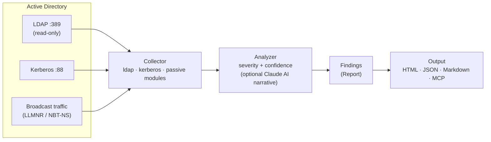

# DIEGO - Domain Intranet Elusive Guardian & Offensive-Scouter

Pure Rust で実装された非特権 Active Directory セキュリティ診断エージェント

---

**DIEGO** は、Active Directory 環境での攻撃後の偵察とセキュリティ診断を行うエージェントです。標準的なドメインユーザー認証情報のみで動作し、ノイズの多いネットワーク動作を生成せず、単一の静的バイナリとして提供されます。

### HTML レポート サンプル

[](docs/sample-report.html)

自己完結型の単一 HTML（CDN 不要・エアギャップ可）。深刻度サマリ、攻撃パス概要、**Severity × Confidence** でソート/フィルタ可能な findings テーブル、Baseline 差分、監査向け Appendix を含みます。**[▶ ライブデモ](https://kent-tokyo.github.io/diego/sample-report.html)** · [サンプル JSON](docs/sample-findings.json)

## アーキテクチャ



標準ユーザー認証情報を入力に、優先度付けされた所見を出力。書き込みなし・OS コマンド実行なし。

---

## 主な特徴

- **非特権実行** — 標準的なドメインユーザー認証情報のみで動作。管理者権限は一切不要です。
- **ステルス性 (OPSEC 対応)** — 正規の AD クエリのみを発行。攻撃的なスキャンなし。リクエスト間の設定可能な遅延により、通常のドメイン トラフィックに溶け込みます。
- **ポータブル** — ランタイム依存なしの単一静的バイナリ。任意のターゲットホストで実行可能。
- **Pure Rust** — .NET CLR、PowerShell、Python インタープリタなし。Kerberos ASN.1 フレーム、LDAP、RC4-HMAC のすべてのプロトコル相互作用は Pure Rust (RustCrypto) で実装。これにより、EDR が .NET/PowerShell ツールの検知に最も依存する *ホストベース* の ETW / AMSI / Script Block Logging テレメトリを回避します。回避**できない**ものについては [検知に関する注意](#検知に関する注意) を参照してください。
- **AI 統合** — Claude API 統合により、スキャン結果を一貫性のある攻撃ナラティブに合成。MCP サーバーモードにより、LLM クライアントが個別の診断ツールを直接調整できます。

---

## クイックスタート

```bash
# CLI モード — すべての診断モジュールを実行
# パスワード省略可：環境変数 → keytab → TGT キャッシュ → 対話的プロンプト の順で試行
diego --dc 10.0.0.1 --domain corp.local --username jdoe

# 明示的にパスワードを指定 (最小限のセキュリティ; 環境変数推奨)
diego --dc 10.0.0.1 --domain corp.local --username jdoe --password P@ss

# AI 分析付き (ANTHROPIC_API_KEY が必要)
diego --dc 10.0.0.1 --domain corp.local --username jdoe --ai-analyze

# スキャン後のインタラクティブ AI チャット
diego ... --ai-analyze --chat

# MCP サーバーモード (Claude Desktop / MCP クライアント用)
diego --mcp
```

### パスワード解決方法 (優先順位順)

`--password` でパスワードが指定されない場合、diego は以下の方法を順に試します：

1. **`$DIEGO_PASSWORD` 環境変数** — スクリプト用の最OPSEC対応
   ```bash
   export DIEGO_PASSWORD="P@ssw0rd"
   diego --dc 10.0.0.1 --domain corp.local --username jdoe
   ```

2. **Kerberos keytab** — `~/.diego/keytab` (パスワード不要)
   ```bash
   # keytab をセットアップ (kinit または ktutil が必要)
   ktutil: addent -password -p user@CORP.LOCAL -k 1 -e aes256-cts-hmac-sha1-96
   ktutil: write_kt ~/.diego/keytab
   
   # その後、パスワードなしで実行
   diego --dc 10.0.0.1 --domain corp.local --username jdoe
   ```

3. **Kerberos TGT キャッシュ** — `KRB5CCNAME` 環境変数または `/tmp/krb5cc_*` (パスワード不要)
   ```bash
   # すでに Kerberos レルムにログインしている場合：
   klist  # キャッシュされたチケットを確認
   diego --dc 10.0.0.1 --domain corp.local --username jdoe
   ```

4. **対話的プロンプト** — 上記が利用不可の場合のフォールバック
   ```
   $ diego --dc 10.0.0.1 --domain corp.local --username jdoe
   パスワード: █████████
   ```

---

## CLI 使用方法と実例

### 構文

```bash
diego [OPTIONS]
```

### 必須オプション (CLI モード)

| オプション | 説明 | 例 |
|-----------|------|-----|
| `--dc <DC>` | ドメインコントローラー IP アドレス | `--dc 10.0.0.1` |
| `--domain <DOMAIN>` | ドメイン名 | `--domain corp.local` |
| `--username <USERNAME>` | 認証用ドメインユーザー | `--username jdoe` |
| `--password <PASSWORD>` | パスワード (`DIEGO_PASSWORD` 環境変数可) | `--password 'P@ssw0rd'` |

### オプションパラメーター

| オプション | デフォルト | 説明 |
|-----------|----------|------|
| `--modules <MODULES>` | `all` | 実行モジュール: `kerberos`, `ldap`, `passive`, `all` |
| `--output <OUTPUT>` | 標準出力 | 出力ファイルパス |
| `--format <FORMAT>` | `json` | 出力形式: `json`、`markdown`、または `html` |
| `--baseline <PATH>` | — | 差分比較する過去の diego JSON レポート（新規 / 解消 / 深刻度変化を表示） |
| `--timeout <TIMEOUT>` | `10` | クエリタイムアウト (秒単位) |
| `--interface <INTERFACE>` | 自動検出 | パッシブリスニング用ネットワークインターフェース |
| `--ai-model <AI_MODEL>` | `claude-sonnet-4-6` | AI 分析用 Claude モデル |

### 実例

#### 1. 完全スキャン (全モジュール)

すべての診断モジュールを実行し、JSON 形式で結果を出力:

```bash
diego --dc 10.0.0.1 --domain corp.local \
  --username jdoe --password 'P@ssw0rd' \
  --format json --output findings.json
```

**出力例 (JSON):**
```json
{
  "domain": "corp.local",
  "dc_ip": "10.0.0.1",
  "timestamp": "2025-06-14T10:30:45Z",
  "modules_run": ["ldap", "kerberos", "passive"],
  "findings": [
    {
      "id": "LDAP-ASREP-candidate-001",
      "severity": "Critical",
      "title": "AS-REP Roastable Account Detected",
      "description": "Account 'svc_backup' has Kerberos pre-authentication disabled",
      "affected_object": "svc_backup",
      "object_type": "user",
      "mitre_tactic": "T1558.001",
      "mitre_technique": "Steal or Forge Kerberos Tickets / AS-REP Roasting",
      "remediation": "Enable Kerberos pre-authentication on the account"
    },
    {
      "id": "KRB-ASREP-HASH-svc_backup",
      "severity": "Critical",
      "title": "AS-REP Hash Captured",
      "description": "Kerberos AS-REP hash captured for offline cracking",
      "affected_object": "svc_backup",
      "object_type": "hash",
      "hash_value": "$krb5asrep$23$svc_backup@CORP.LOCAL:...",
      "mitre_tactic": "T1558.001"
    }
  ],
  "summary": {
    "total_findings": 3,
    "critical": 2,
    "high": 1
  }
}
```

#### 2. Kerberos のみスキャン

AS-REP Roasting と Kerberoasting を実行:

```bash
diego --dc 10.0.0.1 --domain corp.local \
  --username jdoe --password 'P@ssw0rd' \
  --modules kerberos \
  --output kerb_hashes.json
```

Hashcat 互換形式 (`$krb5asrep$`, `$krb5tgs$`) のハッシュを出力。

#### 3. LDAP 列挙のみ

AD トポロジーとポリシー情報をマップ:

```bash
diego --dc 10.0.0.1 --domain corp.local \
  --username jdoe --password 'P@ssw0rd' \
  --modules ldap \
  --format markdown --output domain_report.md
```

**検出される情報:**
- ドメインコントローラーおよびサイトトポロジー
- パスワードポリシー (ロックアウト閾値、経過期間、複雑性)
- 制約なし委任アカウント
- SPN およびサービスアカウント
- 高権限グループメンバー
- Description フィールド認証情報漏洩

#### 4. パッシブ監視 (LLMNR/NBT-NS)

ブロードキャストベース DNS リクエストをキャプチャ:

```bash
diego --dc 10.0.0.1 --domain corp.local \
  --username jdoe --password 'P@ssw0rd' \
  --modules passive \
  --interface eth0 \
  --timeout 30
```

検出対象:
- 未解決ホスト名クエリ (LLMNR/NBT-NS)
- クリアテキストプロトコル使用 (HTTP auth、FTP、SMTP、Telnet 認証情報)
- Responder 攻撃に対して脆弱なホスト

#### 5. AI による攻撃ナラティブ

findings を分析し、攻撃パスを合成:

```bash
export ANTHROPIC_API_KEY="sk-ant-..."

diego --dc 10.0.0.1 --domain corp.local \
  --username jdoe --password 'P@ssw0rd' \
  --ai-analyze \
  --format markdown --output attack_narrative.md
```

**AI 出力例:**
```
## 攻撃ナラティブ: CORP.LOCAL

### エグゼクティブサマリー
ドメインには、ドメイン管理者への迅速なエスカレーションを可能にする 3 つの重大な設定ミスがあります。

### 攻撃チェーン
1. **初期アクセス** — 'svc_backup' アカウントを AS-REP roast (事前認証無効)
2. **権限昇格** — 'ms-sql-svc' を Kerberoast (弱いパスワード)
3. **横展開** — Roasted チケット + 'admin-host-01' の制約なし委任を使用
4. **ドメイン侵害** — DCSync 経由で KRBTGT キーを盗む

### トップ 5 復旧方法 (影響度順)
1. Kerberos 事前認証を有効化 (AS-REP をブロック)
2. サービスアカウントパスワードをローテーション、複雑性を強制
3. 制約なし委任を無効化、制約付き委任を使用
...
```

#### 6. インタラクティブ AI チャット

Findings をインタラクティブに探索:

```bash
diego --dc 10.0.0.1 --domain corp.local \
  --username jdoe --password 'P@ssw0rd' \
  --chat
```

その後、Claude に質問:
```
> 最も重大なリスクは何ですか？
> Kerberoasting 攻撃について詳しく説明してください
> ドメイン管理者への最速パスは何ですか？
> EDR はこれらの技法をどのように検出しますか？
```

#### 7. Markdown レポート (人間向け)

```bash
diego --dc 10.0.0.1 --domain corp.local \
  --username jdoe --password 'P@ssw0rd' \
  --format markdown --output findings.md
```

以下を含む構造化 Markdown を出力:
- エグゼクティブサマリー
- 重大度でグループ化された findings
- MITRE ATT&CK 相互参照
- 各 finding に対する復旧手順
- ネットワーク遅延 / OPSEC ノート

#### 8. MCP サーバーモード (LLM 統合)

Claude Desktop またはカスタム LLM エージェント向けの MCP サーバーとして実行:

```bash
diego --mcp
```

Claude で以下のツールを使用:
- `enumerate_asrep_candidates` — 事前認証無効アカウントをリスト
- `run_asrep_roasting` — AS-REP Roasting を実行
- `run_kerberoasting` — Kerberoasting を実行
- `check_password_policy` — ドメインパスワードポリシーを取得
- `enumerate_privileged_groups` — DA/EA メンバーをリスト

#### 9. カスタムタイムアウト & Jitter

```bash
diego --dc 10.0.0.1 --domain corp.local \
  --username jdoe --password 'P@ssw0rd' \
  --timeout 20 \
  --modules ldap
```

タイムアウトは個別 LDAP クエリに適用。内部 jitter (100–500ms) はリクエスト間に追加。

#### 10. 環境変数でパスワードを指定

```bash
export DIEGO_PASSWORD="MyP@ssw0rd"
export DIEGO_USERNAME="jdoe"

diego --dc 10.0.0.1 --domain corp.local
```

(コマンドラインでの認証情報を避ける — OPSEC 対応)

---

## 診断モジュール

### Kerberos — `Asn1Kerberos`

ポート 88 経由で KDC と直接 ASN.1/Kerberos フレームを使用して相互作用。

- **AS-REP Roasting** — Kerberos 事前認証が無効なアカウントを特定し、AS-REP ハッシュをキャプチャ
- **Kerberoasting** — SPN 付きアカウントのすべてのTGS チケットを要求
- すべてのハッシュは Hashcat 互換形式 (`$krb5asrep$`, `$krb5tgs$`) で出力

### LDAP — `LdapQuery`

ドメインコントローラーに対して読み取り専用 LDAP クエリを実行。

- AD トポロジー列挙 (ドメイン、フォレスト、サイト、信頼)
- Description フィールド認証情報漏洩検出
- 制約のない委任の発見
- パスワードポリシー抽出 (ロックアウト閾値、最小長、複雑性)

### パッシブ監視 — `PassiveListen`

パケット送信なしでローカルネットワークトラフィックを監視。

- LLMNR / NBT-NS ブロードキャスト検出 → 名前ポイズニング攻撃に対して脆弱なホストを特定
- クリアテキストプロトコル監視 (LDAP、HTTP、FTP、Telnet)

### AI 分析

`ANTHROPIC_API_KEY` が必要です。

- Claude による未加工スキャン結果からの攻撃ナラティブ生成
- ドメイン管理者への重要なパスを特定
- 優先順位付きの復旧勧告
- フォローアップ調査のためのインタラクティブチャットモード

---

## MCP サーバーモード

`diego --mcp` で起動時、バイナリは Model Context Protocol サーバーを公開します。MCP 互換クライアント (Claude Desktop、カスタム LLM エージェント) が個別の診断ツールを直接起動できます。

| ツール | 説明 |
|---------|-------------|
| `enumerate_asrep_candidates` | 事前認証が無効なアカウントをリスト |
| `enumerate_spn_accounts` | SPN が登録されているアカウントをリスト |
| `enumerate_constrained_delegation` | S4U2Self → S4U2Proxy 委任を持つアカウント/コンピューターを検索 |
| `enumerate_rbcd` | リソースベース制約付き委任を持つオブジェクトを検索 |
| `enumerate_privileged_groups` | 高権限グループ (DA/EA/Backup Ops など) のメンバーをリスト |
| `enumerate_stale_service_passwords` | パスワード >365 日前の SPN アカウントを検索 |
| `check_unconstrained_delegation` | 制約のない委任を持つコンピューター/アカウントを検索 |
| `check_password_policy` | ドメインパスワード/ロックアウトポリシー + スプレー推定を取得 |
| `scan_description_leaks` | AD Description 内の埋め込み認証情報を検索 |
| `run_asrep_roasting` | AS-REP ハッシュをキャプチャしてオフラインクラッキング用に取得 |
| `run_kerberoasting` | TGS ハッシュをキャプチャしてオフラインクラッキング用に取得 |
| `listen_llmnr` | パッシブ LLMNR/NBT-NS ブロードキャスト監視 |
| `full_scan` | すべてのモジュールを実行して統合 JSON レポートを返却 |

---

## 類似ツールとの比較

| 機能 | **diego** | BloodHound / SharpHound | Impacket (GetUserSPNs 他) | PowerView | Rubeus | PingCastle |
|---------|-----------|-------------------------|-----------------------------|-----------|--------|------------|
| 言語 / ランタイム | Rust — 単一静的バイナリ | C# (.NET) + Python | Python 3 | PowerShell | C# (.NET) | C# (.NET) |
| **Pure Rust / C ランタイムなし** | **はい** | いいえ (.NET CLR) | いいえ (CPython) | いいえ (PS ランタイム) | いいえ (.NET CLR) | いいえ (.NET CLR) |
| 必要な権限 | **標準ユーザーのみ** | エンドポイント上のローカル管理者 | ドメインユーザー (一部操作は管理者必要) | ドメインユーザー | ドメインユーザー | ドメイン管理者推奨 |
| ホストベースのランタイムテレメトリ (ETW/AMSI/SBL) | **回避** — .NET/PS/Python なし | 高 — .NET リフレクション、AMSI | 中 | 高 — AMSI / Script Block Logging | 高 — .NET、既知署名 | 中 |
| DC 側の挙動検知（例: MDI） | **依然として適用** †| 適用 | 適用 | 適用 | 適用 | 適用 |
| アクティブスキャン / ノイズ | **なし** — 読み取り専用 LDAP + Kerberos のみ | あり — SMB、RPC、大量 LDAP ダンプ | 中程度 | 中程度 | あり | あり — 広範な LDAP/RPC |
| Jitter / OPSEC スロットリング | **あり** | なし | なし | なし | なし | なし |
| AS-REP Roasting | **あり** | なし (データのみ) | あり (`GetNPUsers.py`) | なし | **あり** | なし |
| Kerberoasting | **あり** | なし (データのみ) | あり (`GetUserSPNs.py`) | なし | **あり** | なし |
| 制約なし委任 | **あり** | **あり** | 部分的 | **あり** | なし | **あり** |
| パスワードポリシー | **あり** | なし | なし | **あり** | なし | **あり** |
| Description 認証情報漏洩 | **あり** | なし | なし | 部分的 | なし | なし |
| LLMNR/NBT-NS 検出 | **あり** | なし | なし | なし | なし | なし |
| クリアテキストプロトコル検出 | **あり** | なし | なし | なし | なし | なし |
| クロスプラットフォーム (Linux) | **あり** | なし | **あり** | なし | なし | なし |
| AI 分析 (Claude API) | **あり** | なし | なし | なし | なし | なし |
| MCP サーバーモード | **あり** | なし | なし | なし | なし | なし |
| 構造化 JSON 出力 | **あり** | **あり** (Neo4j) | 部分的 | なし | 部分的 | なし (HTML) |
| ゼロインストール / ドロップ実行 | **あり** | なし | なし | なし | なし | なし |

### まとめ

- **BloodHound** は攻撃パス可視化のゴールドスタンダードですが、SharpHound 収集にはローカル管理者が必要で、大量のノイズ (SMB、RPC、LDAP 一括ダンプ) が発生します。Roasting のようなアクティブ攻撃は実施しません。
- **Impacket** は Roasting をよくカバーしていますが、攻撃側マシン上に Python 環境が必要で、侵害されたホスト上で実行できません。
- **Rubeus** は最も高度な Kerberos 攻撃ツールですが、.NET のみ、Windows のみ、EDR に大きく署名されています。
- **PowerView** は LDAP 列挙に強力ですが、PowerShell は最新の SOC で最も監視される実行環境です。
- **PingCastle** は意図面で diego に最も近い (ドメインヘルスチェック) ですが、昇格特権が必要で、HTML のみの出力、ステルスポスチャがありません。
- **diego** はそのギャップを埋めます: Linux または Windows 上の標準ユーザーセッションから実行される単一バイナリ、ホストベースの EDR ランタイムを回避、および AI への発見を直接供給してナラティブ合成を実施。

> † **正直な但し書き。** .NET/PowerShell/Python を避けることで *ホストベース* のランタイムテレメトリは消えますが、根底にある**挙動が不可視になるわけではありません**。[検知に関する注意](#検知に関する注意) を参照してください。

---

## 検知に関する注意

diego は **OPSEC 対応であって、不可視ではありません**。混同されがちな2点を分けて説明します。

1. **ツール自体のホストベース検知。** diego は単一の Pure Rust バイナリのため、.NET CLR / PowerShell / Python のランタイム成果物を生成しません。よって、フットホールド上で Rubeus/PowerView/Impacket を捕捉する ETW・AMSI・Script Block Logging のシグナルは発火しません。これは実測可能な明確な優位点です。

2. **挙動の DC 側検知。** diego が行う *操作* — LDAP 列挙、Kerberoasting（特に RC4 の TGS 要求）、AS-REP roasting — は、**Microsoft Defender for Identity (MDI)** などのディレクトリ側センサーが**クライアントの言語に関係なく**検知対象とするものそのものです。特に **RC4 (`etype 23`) の Kerberoasting は、現代の環境では目立つ、よく署名されたイベント**です。

jitter / スロットリングが「できること」と「できないこと」:

- ✅ *タイミングと量* を平滑化し、通常トラフィックに溶け込ませる。
- ❌ 個々のリクエストの *挙動シグネチャ* は変えない（SPN アカウントに対する RC4 TGS は依然 Kerberoasting に見える）。

**結論:** diego はホストベースの EDR 露出とリクエストバーストの異常を減らします。認可された診断に適しており、ディレクトリ側の挙動は防御側に観測されうる前提で設計されています。「ホストテレメトリが低い」と「検知不能」は別の主張であり、diego は前者のみを主張します。

---

## ビルド

```bash
cargo build --release

# 静的 Linux バイナリ (musl ターゲットが必要)
cargo build --release --target x86_64-unknown-linux-musl
```

リリースプロファイルは LTO、単一コードジェン単位、およびバイナリストリップを適用して、サイズを最小化し、パフォーマンスを最大化します。

---

## OPSEC 注意事項

- いかなる時点でも OS コマンド実行なし — すべての操作は純粋なネットワークプロトコル相互作用です。
- ランダム化された遅延は LDAP および Kerberos リクエスト間に適用され、均一な *タイミング* 署名を回避します（注: jitter は個々のリクエストの *挙動* シグネチャは変えません。[検知に関する注意](#検知に関する注意) を参照）。
- すべてのクエリは、標準的な Windows ドメインワークステーション およびドメイン管理ツールで発行されるクエリと機能的に同一です。
- ディレクトリへの書き込みなし、すべての操作は厳密に読み取り専用です。
- **回避の代替ではありません。** diego はホストベースの EDR 露出を下げますが、ディレクトリ側センサー（例: MDI）は Kerberoasting/AS-REP の挙動を依然観測しえます。AD 診断が認可された環境でのみ使用してください。

---

## ドキュメント

- [Threat Model](docs/THREAT_MODEL.md) — 目的 / 非目的 / 検知前提 / 対応環境 / 制限
- [Benchmarks](docs/BENCHMARKS.md) — 測定方法論（結果はラボ検証待ち）
- [Changelog](CHANGELOG.md)
- [サンプルレポート (HTML)](docs/sample-report.html) · [サンプル JSON](docs/sample-findings.json) · [▶ ライブデモ](https://kent-tokyo.github.io/diego/sample-report.html)

---

## ライセンス

MIT
