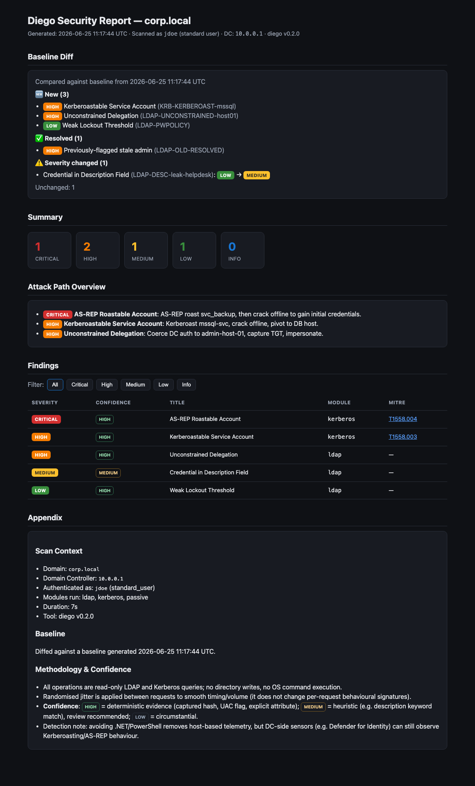
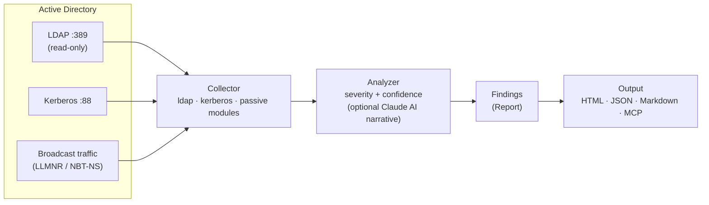

# DIEGO - Domain Intranet Elusive Guardian & Offensive-Scouter

非特权 Active Directory 安全诊断代理，采用纯 Rust 编写。

---

**DIEGO** 是一个用于 Active Directory 环境的后渗透侦察和安全诊断代理。它完全使用标准域用户凭证运行，不会产生任何噪声网络工件，并以单个静态二进制文件的形式发布。

### HTML 报告示例

[](docs/sample-report.html)

单个自包含 HTML（无需 CDN，可离线/隔离网使用）：包含严重性摘要、攻击路径概览、可按 **Severity × Confidence** 排序/过滤的发现表、基线差异，以及审计风格的附录。**[▶ 在线演示](https://kent-tokyo.github.io/diego/sample-report.html)** · [示例 JSON](docs/sample-findings.json)

## 架构



输入标准用户凭证，输出经过优先级排序的发现。无写入、无 OS 命令执行。

---

## 核心支柱

- **非特权** — 仅使用标准域用户凭证工作。在任何阶段都不需要管理员权限。
- **隐蔽（OPSEC 友好）** — 仅发行合法的 AD 查询。无激进扫描。请求之间可配置的随机延迟与正常域流量混合。
- **便携式** — 单个静态二进制文件，零运行时依赖。丢掉即用，运行在任何目标主机上。
- **纯 Rust** — 没有 .NET CLR、没有 PowerShell、没有 Python 解释器。每个协议交互 — Kerberos ASN.1 帧、LDAP、RC4-HMAC — 都以纯 Rust (RustCrypto) 实现。这避免了 EDR 在检测 .NET/PowerShell 工具时最依赖的*基于主机*的 ETW / AMSI / Script Block Logging 遥测。关于它**无法**规避的部分，请参阅 [检测注意事项](#检测注意事项)。
- **AI 优先** — Claude API 集成将扫描输出合成为连贯的攻撃叙述。MCP 服务器模式允许 LLM 客户端直接编排各个诊断工具。

---

## 快速开始

```bash
# CLI 模式 — 运行所有诊断模块
# 密码可以省略；diego 将尝试：环境变量 → keytab → TGT 缓存 → 交互式提示
diego --dc 10.0.0.1 --domain corp.local --username jdoe

# 使用明确密码（最不安全；使用环境变量而不是 shell 历史记录）
diego --dc 10.0.0.1 --domain corp.local --username jdoe --password P@ss

# 使用 AI 分析（需要 ANTHROPIC_API_KEY）
diego --dc 10.0.0.1 --domain corp.local --username jdoe --ai-analyze

# 扫描后进行交互式 AI 聊天
diego ... --ai-analyze --chat

# MCP 服务器模式（适用于 Claude Desktop / MCP 客户端）
diego --mcp
```

### 密码解析（优先级顺序）

如果未提供 `--password` 密码，diego 会按顺序尝试以下方法：

1. **`$DIEGO_PASSWORD` 环境变量** — 对脚本最友好的 OPSEC
   ```bash
   export DIEGO_PASSWORD="P@ssw0rd"
   diego --dc 10.0.0.1 --domain corp.local --username jdoe
   ```

2. **Kerberos keytab** — `~/.diego/keytab`（不需要密码）
   ```bash
   # 设置 keytab（需要 kinit 或 ktutil）
   ktutil: addent -password -p user@CORP.LOCAL -k 1 -e aes256-cts-hmac-sha1-96
   ktutil: write_kt ~/.diego/keytab
   
   # 然后无密码运行
   diego --dc 10.0.0.1 --domain corp.local --username jdoe
   ```

3. **Kerberos TGT 缓存** — `KRB5CCNAME` 环境变量或 `/tmp/krb5cc_*`（不需要密码）
   ```bash
   # 如果已登录到 Kerberos 领域：
   klist  # 检查缓存的票证
   diego --dc 10.0.0.1 --domain corp.local --username jdoe
   ```

4. **交互式提示** — 如果上述都不可用，则降级
   ```
   $ diego --dc 10.0.0.1 --domain corp.local --username jdoe
   Password: █████████
   ```

---

## 诊断模块

### Kerberos — `Asn1Kerberos`

使用原始 ASN.1/Kerberos 帧通过端口 88 与 KDC 直接交互。

- **AS-REP Roasting** — 识别禁用了 Kerberos 预身份验证的账户并捕获 AS-REP 哈希值
- **Kerberoasting** — 为所有具有 SPN 的账户请求 TGS 票证
- 所有哈希值以 Hashcat 兼容格式发出（`$krb5asrep$`、`$krb5tgs$`）

### LDAP — `LdapQuery`

对域控制器执行只读 LDAP 查询。

- AD 拓扑枚举（域、林、站点、信任）
- 描述字段凭证泄露检测
- 无约束委派发现
- 密码策略提取（锁定阈值、最小长度、复杂性）

### 被动 — `PassiveListen`

监控本地网络流量，无需发送任何数据包。

- LLMNR / NBT-NS 广播检测 → 识别容易受名称中毒攻击的主机
- 明文协议监控（LDAP、HTTP、FTP、Telnet）

### AI 分析

需要 `ANTHROPIC_API_KEY`。

- 从原始扫描结果生成 Claude 驱动的攻击叙述
- 关键路径到域管理员合成
- 优先级修复建议
- 用于后续调查的交互式聊天模式

---

## MCP 服务器模式

使用 `diego --mcp` 启动时，二进制文件公开一个模型上下文协议服务器。兼容 MCP 的客户端（Claude Desktop、自定义 LLM 代理）可以直接调用各个诊断工具。

| 工具 | 描述 |
|------|-------------|
| `enumerate_asrep_candidates` | 列出禁用预身份验证的账户 |
| `enumerate_spn_accounts` | 列出具有已注册 SPN 的账户 |
| `enumerate_constrained_delegation` | 查找具有 S4U2Self→S4U2Proxy 委派的账户/计算机 |
| `enumerate_rbcd` | 查找具有基于资源的约束委派的对象 |
| `enumerate_privileged_groups` | 列出高特权组的成员（DA/EA/Backup Ops 等） |
| `enumerate_stale_service_passwords` | 查找密码 >365 天未更改的 SPN 账户 |
| `check_unconstrained_delegation` | 查找具有无约束委派的计算机/账户 |
| `check_password_policy` | 检索域密码和锁定策略 + 喷射估计 |
| `scan_description_leaks` | 在 AD 描述中搜索嵌入凭证 |
| `run_asrep_roasting` | 为离线破解捕获 AS-REP 哈希值 |
| `run_kerberoasting` | 为离线破解捕获 TGS 哈希值 |
| `listen_llmnr` | 被动 LLMNR/NBT-NS 广播监视器 |
| `full_scan` | 运行所有模块并返回合并的 JSON 报告 |

---

## 与类似工具的比较

| 功能 | **diego** | BloodHound / SharpHound | Impacket (GetUserSPNs 等) | PowerView | Rubeus | PingCastle |
|---------|-----------|-------------------------|-----------------------------|-----------|--------|------------|
| 语言 / 运行时 | Rust — 单个静态二进制文件 | C# (.NET) + Python | Python 3 | PowerShell | C# (.NET) | C# (.NET) |
| **纯 Rust / 无 C 运行时** | **是** | 否（.NET CLR） | 否（CPython） | 否（PS 运行时） | 否（.NET CLR） | 否（.NET CLR） |
| 需要特权 | **仅标准用户** | 端点上的本地管理员 | 域用户（某些操作需要管理员） | 域用户 | 域用户 | 建议域管理员 |
| 基于主机的运行时遥测 (ETW/AMSI/SBL) | **规避** — 无 .NET/PS/Python | 高 — .NET 反射、AMSI | 中等 | 高 — AMSI / Script Block Logging | 高 — .NET、已知签名 | 中等 |
| DC 侧行为检测（如 MDI） | **仍然适用** | 适用 | 适用 | 适用 | 适用 | 适用 |
| 主动扫描 / 噪声 | **否** — 仅读 LDAP + Kerberos | 是 — SMB、RPC、大规模 LDAP 转储 | 中等 | 中等 | 是 | 是 — 广泛 LDAP/RPC |
| 随机延迟 / OPSEC 限制 | **是** | 否 | 否 | 否 | 否 | 否 |

---

## 构建

```bash
cargo build --release

# 静态 Linux 二进制文件（需要 musl 目标）
cargo build --release --target x86_64-unknown-linux-musl
```

---

## OPSEC 注释

- 在任何时刻都不执行 OS 命令 — 所有操作都是纯网络协议交互。
- 在 LDAP 和 Kerberos 请求之间应用随机化的随机延迟，以避免统一的*时序*签名（注意：jitter 不改变单个请求的*行为*签名）。
- 所有查询在功能上与标准 Windows 域工作站和域管理工具发出的查询相同。
- 对目录无写入；所有操作严格为只读。
- **不是规避的替代品。** diego 降低基于主机的 EDR 暴露，但目录侧传感器（如 MDI）仍可观测到 Kerberoasting/AS-REP 行为。请仅在获得授权进行 AD 诊断的环境中使用。

---

## 检测注意事项

diego 是 **OPSEC 友好的，而非不可见的**。需要区分两件常被混淆的事：

1. **对工具本身的基于主机的检测。** 作为单个纯 Rust 二进制文件，diego 不产生 .NET CLR / PowerShell / Python 运行时痕迹，因此在立足点主机上捕获 Rubeus/PowerView/Impacket 的 ETW、AMSI、Script Block Logging 信号不会触发。这是实测可见的明确优势。
2. **对行为的 DC 侧检测。** diego 执行的*操作* — LDAP 枚举、Kerberoasting（尤其是 RC4 的 TGS 请求）、AS-REP roasting — 正是 **Microsoft Defender for Identity (MDI)** 等目录侧传感器**无论客户端语言**都要检测的对象。特别是 **RC4 (`etype 23`) Kerberoasting 在现代环境中是一个明显且被充分标记的事件**。

**结论：** diego 降低基于主机的 EDR 暴露和请求突发异常。「主机遥测低」与「不可检测」是不同的主张，diego 仅主张前者。

---

## 文档

- [Threat Model](docs/THREAT_MODEL.md) — 目标 / 非目标 / 检测假设 / 支持环境 / 限制
- [Benchmarks](docs/BENCHMARKS.md) — 测量方法论（结果待实验室验证）
- [Changelog](CHANGELOG.md)
- [示例报告 (HTML)](docs/sample-report.html) · [示例 JSON](docs/sample-findings.json) · [▶ 在线演示](https://kent-tokyo.github.io/diego/sample-report.html)

---

## 许可证

MIT
