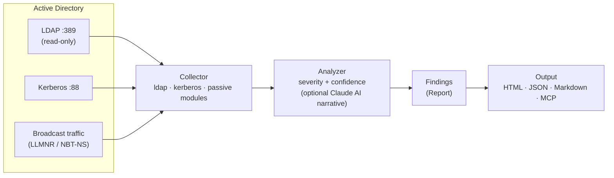

# DIEGO - Domain Intranet Elusive Guardian & Offensive-Scouter

**面向防禦方的 Active Directory 安全診斷** — 純 Rust 編寫，無特權、唯讀，用於**授權評估與防禦基線**（並非攻擊框架，參見 [Threat Model](docs/THREAT_MODEL.md)）。

---

**DIEGO** 協助防禦方與授權評估者從標準域使用者情境識別有風險的 Active Directory 設定。它執行唯讀的 LDAP / Kerberos 診斷，產出結構化證據（JSON / Markdown / HTML / MCP）並支援基線比較——**不寫入目錄、不執行 OS 命令**。以單一靜態二進制檔案交付，且不產生嘈雜的網路製品。（並非攻擊框架，參見 [Threat Model](docs/THREAT_MODEL.md)。）

### HTML 報告範例

[](docs/sample-report.html)

單一自包含 HTML（無需 CDN，可離線/隔離網使用）：包含嚴重性摘要、攻擊路徑概覽、可按 **Severity × Confidence** 排序/篩選的發現表、基線差異，以及稽核風格的附錄。**[▶ 線上展示](https://kent-tokyo.github.io/diego/sample-report.html)** · [範例 JSON](docs/sample-findings.json)

## 架構



輸入標準使用者憑證，輸出經過優先級排序的發現。無寫入、無 OS 命令執行。

---

## 關鍵支柱

- **無特權** — 僅適用於標準域用戶憑證。在任何階段都不需要管理員權限。
- **隱蔽（OPSEC 友善）** — 僅發出合法的 AD 查詢。無侵略性掃描。可配置的請求之間的抖動與正常域流量混合。
- **可攜帶** — 單一靜態二進制檔案，零運行時依賴項。直接放置並在任何目標主機上運行。
- **純 Rust** — 無 .NET CLR、無 PowerShell、無 Python 解釋器。每個協議交互 — Kerberos ASN.1 框架、LDAP、RC4-HMAC — 都在純 Rust（RustCrypto）中實現。這避免了 EDR 在偵測 .NET/PowerShell 工具時最依賴的*基於主機*的 ETW / AMSI / Script Block Logging 遙測。關於它**無法**規避的部分，請參閱 [偵測注意事項](#偵測注意事項)。
- **AI 優先** — Claude API 整合將掃描輸出合成為連貫的攻擊敘述。MCP 服務器模式允許 LLM 客戶端直接協調各個診斷工具。

---

## 快速開始

```bash
# CLI 模式 — 執行所有診斷模組
# 密碼可省略；diego 將嘗試：環境變數 → keytab → TGT 快取 → 互動式提示
diego --dc 10.0.0.1 --domain corp.local --username jdoe

# 使用明確密碼（最不安全；使用環境變數代替以避免 shell 歷史記錄）
diego --dc 10.0.0.1 --domain corp.local --username jdoe --password P@ss

# 使用 AI 分析（需要 ANTHROPIC_API_KEY）
diego --dc 10.0.0.1 --domain corp.local --username jdoe --ai-analyze

# 掃描後互動式 AI 聊天
diego ... --ai-analyze --chat

# MCP 服務器模式（適用於 Claude Desktop / MCP 客戶端）
diego --mcp
```

### 密碼解析（優先順序）

當未提供 `--password` 密碼時，diego 按順序嘗試這些方法：

1. **`$DIEGO_PASSWORD` 環境變數** — 最適用於指令碼的 OPSEC
   ```bash
   export DIEGO_PASSWORD="P@ssw0rd"
   diego --dc 10.0.0.1 --domain corp.local --username jdoe
   ```

2. **Kerberos keytab** — `~/.diego/keytab`（無需密碼）
   ```bash
   # 設置 keytab（需要 kinit 或 ktutil）
   ktutil: addent -password -p user@CORP.LOCAL -k 1 -e aes256-cts-hmac-sha1-96
   ktutil: write_kt ~/.diego/keytab
   
   # 然後無密碼執行
   diego --dc 10.0.0.1 --domain corp.local --username jdoe
   ```

3. **Kerberos TGT 快取** — `KRB5CCNAME` 環境變數或 `/tmp/krb5cc_*`（無需密碼）
   ```bash
   # 如果已登入 Kerberos 領域：
   klist  # 檢查快取的票證
   diego --dc 10.0.0.1 --domain corp.local --username jdoe
   ```

4. **互動式提示** — 如果上述都不可用，回退
   ```
   $ diego --dc 10.0.0.1 --domain corp.local --username jdoe
   密碼: █████████
   ```

---

## 診斷模組

### Kerberos — `Asn1Kerberos`

使用原始 ASN.1/Kerberos 框架直接與 KDC 通過連接埠 88 進行交互。

- **AS-REP Roasting** — 識別禁用 Kerberos 預身份驗證的帳戶並捕獲 AS-REP 雜湊值
- **Kerberoasting** — 為所有具有 SPN 的帳戶請求 TGS 票證
- 所有雜湊值以 Hashcat 相容格式發出（`$krb5asrep$`、`$krb5tgs$`）

### LDAP — `LdapQuery`

對域控制器執行唯讀 LDAP 查詢。

- AD 拓撲列舉（域、樹系、站點、信任）
- 描述欄位認證資訊洩露檢測
- 無約束委派發現
- 密碼原則提取（鎖定閾值、最小長度、複雜性）

### 被動 — `PassiveListen`

監控本地網路流量而不發送任何封包。

- LLMNR / NBT-NS 廣播檢測 → 識別容易遭受名稱中毒攻擊的主機
- 明文協議監控（LDAP、HTTP、FTP、Telnet）

### AI 分析

需要 `ANTHROPIC_API_KEY`。

- 從原始掃描結果生成由 Claude 驅動的攻擊敘述
- 關鍵路徑合成到域管理員
- 優先級補救建議
- 用於後續調查的互動式聊天模式

---

## MCP 伺服器模式

使用 `diego --mcp` 啟動時，二進制檔案會公開模型上下文協議伺服器。相容 MCP 的客戶端（Claude Desktop、自訂 LLM 代理）可以直接呼叫個別診斷工具。

| 工具 | 描述 |
|------|-------------|
| `enumerate_asrep_candidates` | 列出禁用預身份驗證的帳戶 |
| `enumerate_spn_accounts` | 列出具有已登錄 SPN 的帳戶 |
| `enumerate_constrained_delegation` | 查找具有 S4U2Self→S4U2Proxy 委派的帳戶/計算機 |
| `enumerate_rbcd` | 查找具有基於資源的約束委派的物件 |
| `enumerate_privileged_groups` | 列出高權限群組的成員（DA/EA/Backup Ops 等） |
| `enumerate_stale_service_passwords` | 查找密碼 >365 天未更新的 SPN 帳戶 |
| `check_unconstrained_delegation` | 查找具有無約束委派的計算機/帳戶 |
| `check_password_policy` | 檢索域密碼和鎖定原則 + 噴灑估計 |
| `scan_description_leaks` | 在 AD 描述中搜索嵌入認證資訊 |
| `run_asrep_roasting` | 為離線破解捕獲 AS-REP 雜湊值 |
| `run_kerberoasting` | 為離線破解捕獲 TGS 雜湊值 |
| `listen_llmnr` | 被動 LLMNR/NBT-NS 廣播監視器 |
| `full_scan` | 執行所有模組並傳回合併的 JSON 報告 |

---

## 與類似工具的比較

| 功能 | **diego** | BloodHound / SharpHound | Impacket (GetUserSPNs 等) | PowerView | Rubeus | PingCastle |
|---------|-----------|-------------------------|-----------------------------|-----------|--------|------------|
| 語言 / 運行環境 | Rust — 單一靜態二進制 | C# (.NET) + Python | Python 3 | PowerShell | C# (.NET) | C# (.NET) |
| **純 Rust / 無 C 運行環境** | **是** | 否（.NET CLR） | 否（CPython） | 否（PS 運行環境） | 否（.NET CLR） | 否（.NET CLR） |
| 所需權限 | **僅標準使用者** | 端點上的本地管理員 | 域使用者（某些操作需要管理員） | 域使用者 | 域使用者 | 建議使用域管理員 |
| 基於主機的執行階段遙測 (ETW/AMSI/SBL) | **規避** — 無 .NET/PS/Python | 高 — .NET 反射、AMSI | 中等 | 高 — AMSI / Script Block Logging | 高 — .NET、已知簽章 | 中等 |
| DC 側行為偵測（如 MDI） | **仍然適用** | 適用 | 適用 | 適用 | 適用 | 適用 |
| 主動掃描 / 雜訊 | **否** — 僅讀 LDAP + Kerberos | 是 — SMB、RPC、大量 LDAP 轉儲 | 中等 | 中等 | 是 | 是 — 廣泛 LDAP/RPC |
| 隨機延遲 / OPSEC 節流 | **是** | 否 | 否 | 否 | 否 | 否 |

---

## 構建

```bash
cargo build --release

# 靜態 Linux 二進制（需要 musl 目標）
cargo build --release --target x86_64-unknown-linux-musl
```

---

## OPSEC 注意事項

- 在任何時間都沒有 OS 命令執行 — 所有操作都是純網路協議交互。
- 在 LDAP 和 Kerberos 請求之間應用隨機化延遲，以避免均勻的*時間*簽名（注意：jitter 不改變單個請求的*行為*簽章）。
- 所有查詢在功能上與標準 Windows 域工作站和域管理工具所發出的相同。
- 對目錄無寫入；所有操作嚴格為唯讀。
- **不是規避的替代品。** diego 降低基於主機的 EDR 暴露，但目錄側感測器（如 MDI）仍可觀測到 Kerberoasting/AS-REP 行為。請僅在獲授權進行 AD 診斷的環境中使用。

---

## 偵測注意事項

diego 是 **OPSEC 友善的，而非不可見的**。需要區分兩件常被混淆的事：

1. **對工具本身的基於主機的偵測。** 作為單一純 Rust 二進制檔，diego 不產生 .NET CLR / PowerShell / Python 執行階段痕跡，因此在立足點主機上捕捉 Rubeus/PowerView/Impacket 的 ETW、AMSI、Script Block Logging 訊號不會觸發。這是實測可見的明確優勢。
2. **對行為的 DC 側偵測。** diego 執行的*操作* — LDAP 列舉、Kerberoasting（尤其是 RC4 的 TGS 請求）、AS-REP roasting — 正是 **Microsoft Defender for Identity (MDI)** 等目錄側感測器**無論用戶端語言**都要偵測的對象。特別是 **RC4 (`etype 23`) Kerberoasting 在現代環境中是一個明顯且被充分標記的事件**。

**結論：** diego 降低基於主機的 EDR 暴露與請求突發異常。「主機遙測低」與「不可偵測」是不同的主張，diego 僅主張前者。

---

## 文件

- [Threat Model](docs/THREAT_MODEL.md) — 目標 / 非目標 / 偵測假設 / 支援環境 / 限制
- [Benchmarks](docs/BENCHMARKS.md) — 測量方法論（結果待實驗室驗證）
- [Changelog](CHANGELOG.md)
- [範例報告 (HTML)](docs/sample-report.html) · [範例 JSON](docs/sample-findings.json) · [▶ 線上展示](https://kent-tokyo.github.io/diego/sample-report.html)

---

## 授權

MIT
